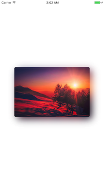
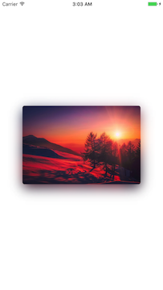
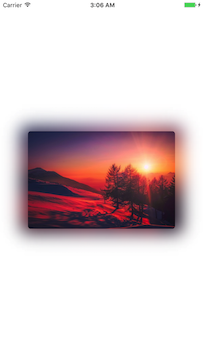
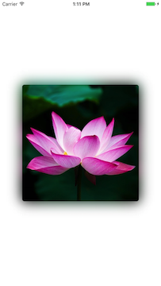
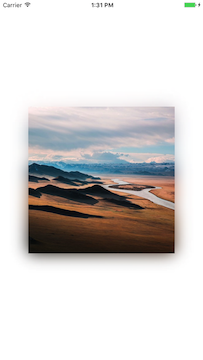
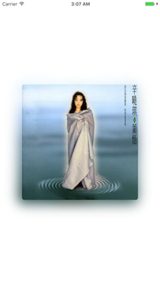
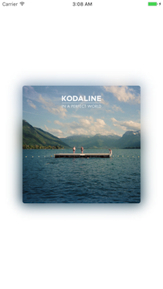

# ShadowImageView Support Swift 5

 
 

A apple music cover picture shadow style image library

ShadowImageView is a iOS 10 Apple Music style image view, help you create elegent image with shadow.


## Renderings

   

   


## Features

- [x] Auto resizing based on content mode.
- [x] Easy to change paramenters including offset, radius, alpha etc.
- [x] Storyboard(Nib) support.


## TODO

- [ ] Add support for UIView.
- [ ] Change the way of layout, to minimize the resource usa.

## Usage


### Import

#### Manually
1. Download and drop ```ShadowImageView.swift``` in your project.  
2. Congratulations!

### Parameters

```swift
    /// Gaussian Blur radius, larger will make the back ground shadow lighter (warning: do not set it too large, 2 or 3 for most cases)
    @IBInspectable
    public var blurRadius: CGFloat
    
    /// The image view contains target image
    @IBInspectable
    public var image: UIImage
    
    /// Image's corner radius
    @IBInspectable
    public var imageCornerRaidus: CGFloat
    
    /// shadow radius offset in percentage, if you want shadow radius larger, set a postive number for this, if you want it be smaller, then set a negative number
    @IBInspectable
    public var shadowRadiusOffSetPercentage: CGFloat
    
    /// Shadow offset value on x axis, postive -> right, negative -> left
    @IBInspectable
    public var shadowOffSetByX: CGFloat
    
    
    /// Shadow offset value on y axis, postive -> right, negative -> left
    @IBInspectable
    public var shadowOffSetByY: CGFloat
    
    /// Shadow alpha value
    @IBInspectable
    public var shadowAlpha: CGFloat

```

If you want to add by storyboard or nib, just drap a UIView into your canvas, and change the class to ShadowImageView, you will see the change in storyboard or nib, it is @IBDesignable supported.


## Requirements

- iOS 10.0+
- Swift 5+

The main development of ShadowImageView is based on Swift 3.

## Support

### Contact

Follow and contact me through email: olddonkeyblog@gmail.com. If you find an issue, just [open a ticket](https://github.com/olddonkey/ShadowImageView/issues/new) on it. Pull requests are warmly welcome as well.


### License

ShadowImageView is released under the MIT license. See LICENSE for details.


### Kudos

Thanks to [PierrePerrin](https://github.com/PierrePerrin), his [PPMusicImageShadow](https://github.com/PierrePerrin/PPMusicImageShadow) inspires me, though the implementation is diffrent, the main idea comes from GaussianBlur.


### App using ShadowImageView

1. [优读](https://itunes.apple.com/us/app/优读-订阅收藏和碎片知识管理神器/id1175225244) 

    


